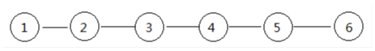

## 课程内容

- 线性表的表达方式
- 顺序表数据结构

# 一 线性数据结构

​		线性表包括了（顺序表、链表、栈、队列）

## 	1线性表的表达方式

​	表达方式有什么作用？不仅仅是沟通的需要，还是思考问题的定位。快速的使用现有的规则和逻辑，新事物快速建立认知。

#### 	1.1 **线性表是包含若干数据元素的一个线性序列**

​			记为： L=(d[0], ...... d[i-1], d[i], d[i+1] ...... d[n-1])

​			L为表名，d[i](0≤i≤n-1为数据元素；

​			n为表长,n>0 时，线性表L为非空表，否则为空表。

#### 	 1.2 **线性表L可用二元组形式描述：**

  			L= (D,R)

​		即线性表L包含数据元素集合D和关系集合R

  			D={d[i] | d[i]∈datatype ,i=0,1,2, ∙∙∙∙∙∙∙∙∙n-1 ,n≥0}

  			R={<d[i] , d[i+1]> | d[i] , d[i+1]∈D, 0≤i≤n-2}

​				1、关系符<d[i], d[i+1]>在这里称为有序对

​				2、表示任意相邻的两个元素之间的一种先后次序关系

​				3、d[i]是d[i+1]的直接前驱, d[i+1]是a[i]的直接后继

####  1.3 **设有一个表L={1,2,3,4,5,6};  他们的关系如图:**	



​	使用二元组描述L=(D,R),则

  		D={1 , 2 , 3 , 4 , 5 , 6}(n=6)

  		R={<1,2> , <2,3> , <3,4> , <4,5> , <5,6>}

#### 	1.4 **线性表的特征：**

​		1) 对非空表,d[0]是表头,无前驱；

​		2) d[n-1]是表尾,无后继；

​		3) 其它的每个元素d[i]有且仅有一个直接前驱d[i-1]和一个直接后继d[i+1]。


## 2 顺序存储结构（数组）

​		想象面前一排排的格子，固定大小、数量。


#### 2.1 **顺序存储结构的特点**

​		•逻辑上相邻的元素 d[i], d[i+1]，其存储位置也是相邻的

​		•对数据元素d[i]的存取为随机存取或按地址存取

​		•存储密度高

​		•存储密度D=(数据结构中元素所占存储空间)/（整个数据结构所占空间）

####  2.2 **在C语言中，可借助于一维数组类型来描述线性表的顺序存储结构**

```c
#define  N 100       
typedef   int  data_t;
typedef  struct  SQ                
{   
    data_t data[N]； //表的存储空间
    int size;   
}sqlist, *sqlink;   

Array* ReCreate(Array* arr, int newSize)
{
    // 重新创建内存
    // 把原来的arr搬移到新的内存空间
    // 返回新的空间地址
}

```

|    d[0]     | d[1] | ...  | d[i] | ...  |      d[n-1]      |
| :---------: | :--: | :--: | :--: | :--: | :--------------: |
| SQ->data[0] |      |      |      |      | SQ->data[size-1] |

​      

#### 2.3 **寻址方式**（找到数据元素的基本算法）

​	在C语言中，数组的下标访问的底层逻辑。

​	若将线性表L=(d[0],d[1], ……,d[n-1])中的各元素依次存储于计算机一片连续的存储空间。

​	设Loc(d[i])为d[i]的地址，Loc(d[0])=a，每个元素占s个单元 则：Loc(d[i])=a+i*s       

| d[0] | d[1] | ...  | d[i]  | ...  |  d[n-1]   |
| :--: | :--: | :--: | :---: | :--: | :-------: |
|  a   | a+s  |      | a+i*s |      | a+(n-1)*s |

​      

#### 2.4 常用接口与代码实现

​	一个问题，目前的学习中，用到过数组吗？具体的程序是做什么？

​	一般来讲，我们见到的数据结构，都有现成的代码库可以使用。但我们为了更好地理解，争取我们自己去实现它。

​	下面代码就以数组来举例了，数组不是库，已经是语言的一部分，我们就直接使用数组，不用再去实现他的底层逻辑。

##### 	2.4.1 **声明（创建出来）与销毁** 

~~~c

// 基本数据元素，可以看着一个容器，内容可以后期定义，但始终是编译前确定
typedef   struct ARR_DATA ArrData,*PArrData;
struct ARR_DATA
{
    int data; 
};

// 主要的数据对象，后面的一切操作都是在这个里面进行
typedef   struct ARRAY Array,*PArray;
struct ARRAY
{
    ArrData *arr;
    int     size;
};


// 创建数据对象
Array* CreateArr(int size)
{
    Array* pArr = malloc(sizeof(Array));
    pArr->arr = malloc(sizeof(ArrData) * size);
    pArr->size = size;
    return pArr;
}

// 销毁数据对象
void DestroyArr(Array* pArr)
{
    if(pArr==NULL)
        return;

    free(pArr->arr);
    free(pArr);
}

// 初始化
// 获取某个元素
// 添加
// 插入
// 删除-不保持连续性
// 删除-保持连续性


~~~

#####  2.4.2	**初始化**

```c
// 初始化成原始的样子，也就是没有数据的样子
void Clear(Array* pArr)
{
    if(pArr==NULL)
        return;

    for(int i=0; i<pArr->size; ++i)
    {
        // 我们设定0作为没有数据，假如0是有意义的，可以设置-1或者一个没有实际意义的值作为没有数据的值
        pArr->arr[i].data = 0;	
    }
}


```

##### 2.4.3	**访问某个数据** Get

~~~c
// 获取数据
int Get(Array* pArr, int idx)
{
    if(pArr==NULL)
        return -1;
    if(idx<0 || idx>=pArr->size)
        return -1;

    return pArr->arr[idx].data;
}
~~~

##### 2.4.4	**遍历，参考初始化** 

~~~c
// 循环访问数组中的每一个元素，根据数组大小决定循环次数
for(int i=0; i<pArr->size; ++i)
{
    // 我们设定0作为没有数据，假如0是有意义的，可以设置-1或者一个没有实际意义的值作为没有数据的值
    pArr->arr[i].data = 0;	
}
~~~

##### 2.4.5	**添加** add，一个蕴含的意义是可能没有数据，需要对没有数据进行定义

```c
// 添加的函数，返回添加的位置，无法添加返回-1
int Add2Arr(Array* pArr, int data)
{
    if(pArr==NULL)
        return;

    for(int i=0; i<pArr->size; ++i)
    {
        if(pArr->arr[i].data==0)
        {
            pArr->arr[i].data = data;
            return i;
        }
    }
    return -1;
}

// 实际添加操作
int idx = Add2Arr(5);
```

##### 2.4.6	**插入** insert

```c
// 将数据插入到某个位置，如果成功返回所插入的位置上，失败则返回-1
int Insert2Arr(Array* pArr, int idx, int data)
{
    if(pArr==NULL)
        return;

    // 先判断插入位置是否合法
    if(idx<0 || idx>=pArr->size)
        return -1;
    
    // 判断插入数据后面是否有空位，并且找到这个空位（如果允许溢出，则无视这一步）
    int emptyIdx = -1;
    for(int i=idx; i<pArr->size; ++i)
    {
        if(pArr->arr[i].data==0)
        {
            emptyIdx = i;
            break;
        }
    }
    if(emptyIdx==-1)
        return -1;
    
    // 搬移插入位置后面的数据（后移），腾出位置
    for(int i=emptyIdx-1; i>=idx; --i)
    {
        pArr->arr[i+1] = pArr->arr[i];
    }
    
    // 插入
    pArr->arr[idx].data = data;
}

```

##### 2.4.7	**删除（不保持现有数据的连续）** delete

```c
// 删除，不保持数据的连续 
int Delete_Direct(Array* pArr, int idx)
{
    if(pArr==NULL)
        return;

    // 先判断插入位置是否合法
    if(idx<0 || idx>=pArr->size)
        return -1;
    
    // 设置为无数据状态
    pArr->arr[idx].data = 0;
}

```

##### 2.4.8	**删除（保持现有数据的连续）** delete

```c
// 删除，保持数据的连续 
int Delete(Array* pArr, int idx)
{
    if(pArr==NULL)
        return;

    // 先判断插入位置是否合法
    if(idx<0 || idx>=pArr->size)
        return -1;
    
    // 设置为无数据状态
    pArr->arr[idx].data = 0;
    
    // 将后面的数据前移，保证数据的连续性
    for(int i=idx; i<pArr->size; ++i)
    {
        pArr->arr[i] = pArr->arr[i+1];
    }
}
```

##### 2.4.9	**主逻辑和其他用到的函数**

```c

// 打印输出当前数组的列表
void OutPrint(Array* pArr, char *mark)
{
    if(pArr==NULL)
        return;

    printf("%s,当前数组: [", mark);
    for(int i=0; i<pArr->size; ++i)
    {
        printf("%d,", pArr->arr[i].data);
    }
    printf("]\n");
    
    // 每次打印输出以后，暂停输入控制再继续
    scanf("%s");
}


int main()
{
    printf("Start...\n");
    
    Array* pArr = CreateArr(5);
    // 定义用到的返回值
    int ret;

    // 初始化成原始的样子，也就是没有数据的样子
    Clear(pArr);

    // 添加2个数据
    ret = Add2Arr(pArr,1);
    ret = Add2Arr(pArr,2);
    
    // 看看数据什么样子
    OutPrint(pArr,(char*)"添加数据以后");
    
    // 再插入一个数据在中间
    ret = Insert2Arr(pArr,1, 3);

    // 再看看数据什么样子
    OutPrint(pArr,(char*)"插入数据以后");
    
    // 删除一个数据，不保持现有数据的连续
    ret = Delete_Direct(pArr, 1);
    
    // 再看看数据什么样子
    OutPrint(pArr, (char*)"删除不保持连续以后");
    
    // 再添加一个数据（因为有空档，实际是放在第一个空位）
    ret = Add2Arr(pArr, 4);
    
    // 再看看数据什么样子
    OutPrint(pArr, (char*)"在添加数据以后");
        
    // 删除一个数据，保持现有数据的连续
    ret = Delete(pArr, 1);
    
    // 再看看数据什么样子
    OutPrint(pArr, (char*)"删除保持连续以后");

    // 最后释放数据对象
    DestroyArr(pArr);
    
    return 0;
}
```


#### 2.5 其他

​		求实际长度 length

​		判断是否为空 isEmpty

​		定位某个数据元素的位置上 （indexOf） 如果存在，返回第一个的位置(从0开始)，否则返回-1

#### 2.6 顺序表的优缺点

​	线性表的顺序存储结构有存储密度高及能够随机存取，访问效率高等优点，但存在以下不足：

​		(1)要求系统提供一片较大的连续存储空间。

​		(2)插入、删除等运算耗时，且存在元素在存储器中成片移动的现象；

#### 2.7 思考题

​	1）完成1.2.5其他里面的三个函数

​	2）如果我们硬要实现动态扩容，可以实现啊？怎么做？尝试一下


