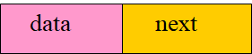
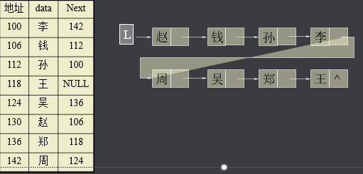
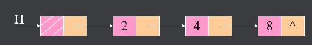
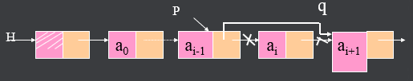
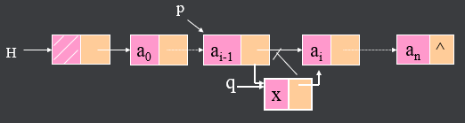
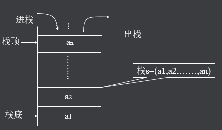
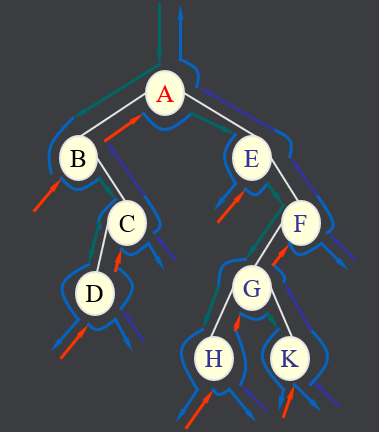
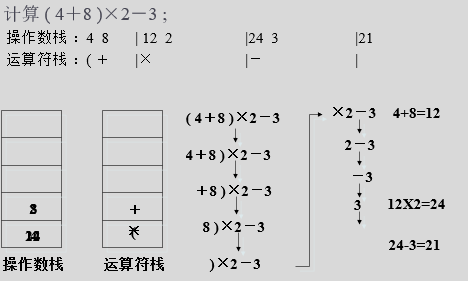

## 课程内容

- ​	链表
- ​    栈

# 一 线性数据结构

## 	3 链表

​	针对数组存在的缺点，我们引入链表这个数据结构

### 3.1	**链表结构**

将线性表L=(a0,a1,……,an-1)中各元素分布在存储器的不同存储块，称为结点，通过地址或指针建立元素之间的联系   



结点的data域存放数据元素ai，而next域是一个指针，指向ai的直接后继ai+1所在的结点。

设线性表L=(赵，钱，孙，李，周，吴，郑，王)，各元素在存储器中的分布如图



### 3.2 **结点代码结构**

```c
// 结点数据，组成链表的基本数据元素，也是一个容器
typedef struct LIST_NODE ListNode,*PListNode;
struct LIST_NODE
{
    int data;
    ListNode* next;
};

// 创建新的结点
PListNode NewNode(int data)
{
    PListNode node = (PListNode)malloc(sizeof(ListNode));
    node->data = data;
    node->next = NULL;
}

// 销毁结点，不负责关系维护
void Delete(PListNode node)
{
    free(node);
}
```

### 3.3 链表结构与代码实现

​	以数据对象的角度来建立整个链表结构；



​	我们一起来实现添加、索引、定位、删除、插入

### 3.4	**代码结构**

```c
// 链表数据对象
typedef struct LIST List,*PList;
struct LIST
{
    ListNode* header;
};

// 创建链表数据对象
List*    CreateList()
{
    List* lst = (List*)malloc(sizeof(List));
    lst->header = NULL;
    return lst;
}

// 销毁x链表数据对象
void    Destroy(List* lst )
{
    if(lst==NULL)
        return;

    PListNode node = lst->header;
    do{
        PListNode next = node->next;
        Delete(node);
        node = next;
    }while(node!=NULL);
    
    free(lst);
}
```

#### 3.4.1	添加

```c
// 链表中添加一个数据元素在末尾
PListNode   Add(List* lst , int data)
{
    if(lst==NULL)
        return;

    PListNode node = NewNode(data);

    PListNode last = lst->header;
    if(last==NULL){
        lst->header = node;
    }else{
        while(last->next!=NULL)
            last = last->next;
        last->next = node;
    }
    
    return node;
}
```

#### 3.4.2	查找

```c
// 查找，
PListNode   Get(List* lst,int idx)
{
    if(lst==NULL)
        return;

    PListNode node = lst->header;
    for(int i=0; i<idx; ++i)
    {
        if(node==NULL)
            break;
        node = node->next;
    }

    return node;
}
```

#### 3.4.3	定位

```c
// 定位，
int  indexOf(List* lst,int data)
{
    if(lst==NULL)
        return;

    int idx = 0;
    PListNode node = lst->header;
    while(node!=NULL)
    {
        if(node->data==data)
            return idx;
        node = node->next;
        ++idx;
    }
    return -1;
}
```


#### 3.4.4	删除



```c
// 删除，
void   Remove(List* lst,int idx)
{
    if(lst==NULL)
        return;

    if(idx==0)
    {
        PListNode node = lst->header;
        lst->header = node->next;
        Delete(node);
    }else{
        PListNode last = Get(lst, idx-1);
        if(last!=NULL)
        {
            PListNode node = last->next;
            last->next = node->next;
            Delete(node);
        }
    }
}
```


#### 3.4.5	插入



```c
// 插入
PListNode   Insert(List* lst,int  idx, int data)
{
    if(lst==NULL)
        return;

    PListNode node = NULL;
    if(idx==0)
    {
            node = NewNode(data);
            node->next = lst->header;
            lst->header = node;
    }else{
        PListNode last = Get(lst, idx-1);
        if(last!=NULL)
        {
            PListNode node = NewNode(data);
            node->next = last->next;
            last->next = node;
        }
    }
    
    return node;
}
```

#### 3.4.6 主逻辑和其他用到的函数

```c
// 打印输出当前的列表
void OutPrint(List* lst , char *mark)
{
    printf("%s,当前: <", mark);
    ListNode *next = lst->header;
    while(next!=NULL)
    {
        printf("%d,", next->data);
        next = next->next;
    }
    printf(">\n");
    
    // 每次打印输出以后，暂停输入控制再继续
    scanf("%s");
}

int main()
{
    printf("Start List...\n");

    //  创建链表
    List*  lst = CreateList();  

    // 添加数据元素 * 2
    Add(lst, 11);
    Add(lst, 66);

    // 打印输出当前列表
    OutPrint(lst, "初始化后列表");

    // 插入
    Insert(lst, 1, 33);

    // 打印输出当前列表
    OutPrint(lst, "插入后列表");

    // 查找
    PListNode pNode = Get(lst, 1);

    // 定位
    int idx = indexOf(lst, 33);

    // 打印输出查找和定位
    printf("查找和定位结果: %d, %d\n", pNode->data, idx);

    // 删除
    Remove(lst, 1);

    // 打印输出当前列表
    OutPrint(lst, "删除后列表");
    
    // 最后别忘了释放数据对象
    Destroy(lst);
}
```


#### 3.4.7 思考题

​	1）自己尝试去实现获取链表长度（Lenth）和是否为空的函数（IsEmpty）

​	2）在现在基础上实现双向链表，并且总结看看能有什么好处？


## 	4 栈

### 	4.1 栈的结构

​		栈是限制在一端进行插入操作和删除操作的线性表（俗称堆栈）

​		允许进行操作的一端称为“栈顶”

​		另一固定端称为“栈底”

​		当栈中没有元素时称为“空栈”。特点 ：后进先出（LIFO）或者叫先进后出(FILO?)。 

​		

### 	4.2 栈有啥用

​		非常常用，生活中也很常见，洗碗，翻书，^Z/^Y；

​		程序开发中常用于带路径出入的计算中作为缓存，比如递归，树形查找，寻路算法。

​		这类事务中，每一个计算结点(根据业务需要分割)的数据，在深入下一个计算结点的时候需要缓存，计算结果需要原路返回收集中间数据进行后续加工。或者每一个计算结点需要对现场进行修改，退出结点时要还原现场，怎么保证每次还原的数据是当时的现场数据，就靠堆栈。






### 4.3 栈的分类

​	一般根绝存出结果分为顺序存储和链式存储，一般使用的链式存储方式，下面都已链式来介绍。

### 4.4  怎么实现（链式存储）

​	与链表类似，但是我们关注的是栈顶，也就是最后一个数。

​	结点的数据结构完全可以使用链表的结点数据结构 （ListNode）

#### 	4.4.1 数据对象结构

```c
typedef struct STACK Stack,*PStack;
struct STACK
{
    ListNode* top;
};

// 创建堆栈数据对象
Stack* CreateStack()
{
    Stack* stack = malloc(sizeof(Stack));
    stack->top = NULL;
    return stack;
}

// 销毁堆栈数据对象
void Destroy(Stack* stack)
{
    if(stack==NULL)
        return;

    PListNode node = stack->top;
    while(node!=NULL)
    {
        PListNode curNode = node;
        node = node->next;
        Delete(curNode);
    }
}
```


#### 	4.3.2 放入

```c
// 入栈
ListNode*  Push(Stack* stack, int data)
{
    if(stack==NULL)
        return NULL;

    ListNode* node = malloc(sizeof(ListNode));
    node->data = data;
    node->next = stack->top;
    stack->top = node;
    return node;
}
```


#### 	4.3.3 拿出

```c
// 出栈
int Pop(Stack* stack)
{
    if(stack==NULL)
        return 0;

    if(stack->top==NULL)
        return 0;

    ListNode* node = stack->top;
    stack->top = stack->top->next;

    int data = node->data;
    Delete( node);

    return data;
}
```


#### 	4.3.4 主测试逻辑

```c
int main()
{
    printf("Start Stack...\n");

    // 创建栈数据对象
    Stack* stack = CreateStack();

    Push(stack, 101);
    Push(stack, 102);
    Push(stack, 103);
    int p1 = Pop(stack);
    Push(stack, 104);
    int p2 = Pop(stack);
    int p3 = Pop(stack);
    int p4 = Pop(stack);
    int p5 = Pop(stack);

    printf("出栈顺序：%d,%d,%d,%d,%d\n", p1, p2, p3, p4,p5);

    // 释放栈数据对象
    Destroy(stack);

    scanf("%s");
}


// 输出结果:
// 出栈顺序：103,104,102,101,0
```


### 4.4 思考题

​		1）考虑一个生活中的例子

​		2）尝试将容器换成其他你想要的数据类型；

​		3）利用你改造的栈数据算法来尝试实现加减乘除运算式的递归解析运算，能完成最好，不能完成可以写伪代码，表达基本逻辑；


