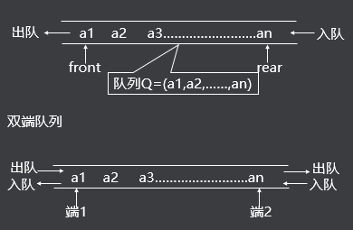
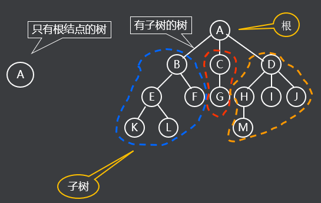
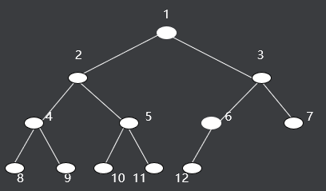
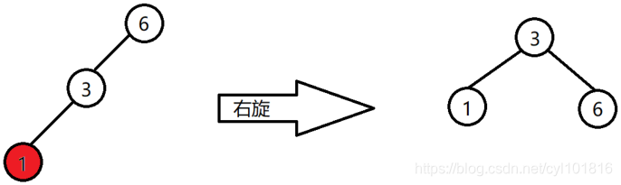
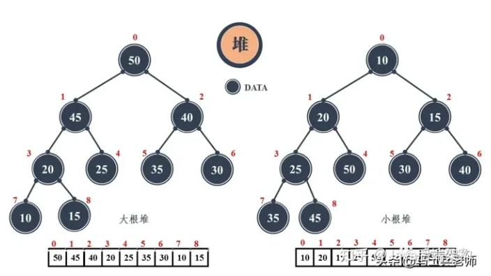
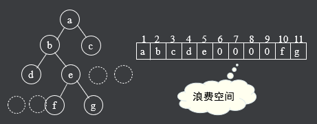
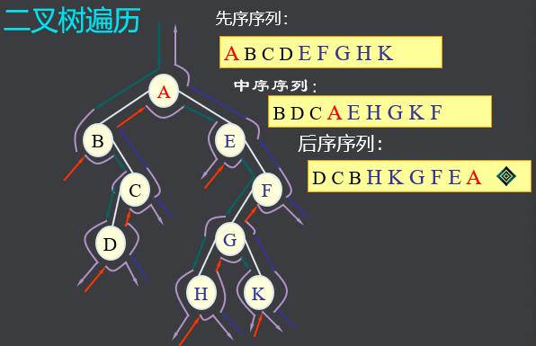
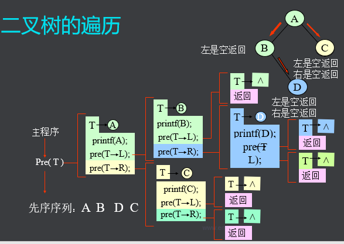

## 课程内容

- ​	队列
- ​    非线性数据结构  树

# 一 线性数据结构

## 	5 队列

### 		5.1 队列的结构

​		与栈类似，一般是从一头入，从另一头出。



- 队列是限制在两端进行插入操作和删除操作的线性表
- 允许进行存入操作的一端称为“队尾”
- 允许进行删除操作的一端称为“队头”
- 当线性表中没有元素时，称为“空队”
- 特点 ：先进先出（FIFO）

### 5.2 队列有啥用

​		排队、任务调度、高并发时用到（比如消息队列）

### 5.3 代码结构

​	队列的基础结构

~~~c
// 队列数据对象数据结构
typedef struct QUEUE Queue,*PQueue;
struct QUEUE
{
    ListNode* top;      // 头
    ListNode* tail;      // 尾
};


/* 
* 一下补充数据容器对象代码 
*/
// 数据元素结构，也是一个容器
typedef struct DATA_T Data,*PData;
struct DATA_T
{
    int     val;
};

// 数据元素容器构建
Data* NewData(int val)
{
    Data* data = malloc(sizeof(Data));
    data->val = val;
    return data;
}

// 数据元素删除
void DelData(Data* data)
{
    if(data==NULL)
        return;
    free(data);
}
~~~

​	思考：队列有一头一尾，如果作为单向链表，从头指向尾，那么要实现先进先出，新进入的放在头还是尾，或者说即将拿出的是放在头还是尾？为什么？

#### 	5.3.1 push

```c
// 加入队列，新加入的始终在尾
ListNode*  Push(Queue* queue, Data* data)
{
    if(queue==NULL)
        return NULL;

    ListNode* node = NewNode(data);

    // 新加入的在尾部，尾部x对象指向当前结点
    if(queue->tail!=NULL)
        queue->tail->next = node;
    queue->tail = node;

    // 也有可能是第一个哦
    if(queue->top==NULL)
        queue->top = node; 

    return node;
}
```


#### 	5.3.2 peek

```c
// 查看第一个数据元素，不拿走
Data*       Peek(Queue* queue)
{
    if(queue==NULL)
        return NULL;

    if(queue->top==NULL)
        return NULL;

    return queue->top->data;
}
```


#### 	5.3.3 poll

```c
// 拿走第一个数据元素
Data*        Poll(Queue* queue)
{
    if(queue==NULL)
        return 0;

    ListNode* node = queue->top;
    if(node!=NULL)
    {
        queue->top = node->next;
        return node->data;
    }

    return 0;
}
```


#### 	5.3.4 主逻辑

```c
void OutAndDelData(Data* data)
{
    if(data==NULL)
        return NULL;
    printf("取出数据%d\n", data->val);
    DelData(data);
}

int main()
{
    printf("Start Queue...\n");

    // 创建队列
    Queue* queue = CreateQueue();

    // 加入队列
    Push(queue,  NewData(1));
    Push(queue,  NewData(2));
    Push(queue,  NewData(3));

    // 查看数据并打印
    Data* data = Peek(queue);
    printf("查看数据%d\n", data->val);

    // 取出数据并打印
    data = Poll(queue);
    OutAndDelData(data);

    // 再计入队列
    Push(queue,  NewData(4));
    Push(queue,  NewData(5));

    // 全部取完并打印
    data = Poll(queue);
    while(data!=NULL)
    {
        OutAndDelData(data);
        data = Poll(queue);
    }

    // 销毁队列
    Destroy(queue);
}
```


### 5.4 思考题：

​	1）如果需要限制队列大小，怎么做？觉得限制大小重要吗？

​	2）循环队列如何实现？还是用链表吗？什么作用？降噪算法

# 二  非线性数据结构

## 	1 树

### 	1.1 树是个啥玩意儿


​		树（Tree）是n（n≥0）个结点的有限集合T，它满足两个条件 ：

​		有且仅有一个特定的称为根（Root）的结点；

​		其余的结点可以分为m（m≥0）个互不相交的有限集合T1、T2、……、Tm，其中每一个集合又是一棵树，并称为其根的子树



​		树的逻辑结构 ：树中任何结点都可以有零个或多个直接后继结点（子结点），但至多只有一个直接前趋结点（父结点），根结点没有前趋结点，叶结点没有后继结点。

### 	1.2 树的一些概念

​		**结点、根结点、树叶、子树**；

​		**度数：**一个结点的子树的个数称为该结点的度数，一棵树的度数是指该树中结点的最大度数；度数为零的结点称为**树叶**或**终端结点**，度数不为零的结点称为分支结点，除根结点外的分支结点称为内部结点。

​		**树的高度或深度：**树中结点层数的最大值；没你想的那么深，64格米粒的故事

​		**有序树：**每个结点的各个子树的排列为从左到右，不能交换，即兄弟之间是有序的，则该树称为**有序树**。

​		**森林：**m（m≥0）棵互不相交的树的集合称为**森林**

### 	1.3 树的强大功能

​		简单地说，树是我们认识这个世界的一种方式。这个方式不一般，掌握其规律，你会更清晰的看待这个世界，也让你的**认知段位**提升N个层次。

​		建立层次，世界都是文件夹结构；

​		进行分类，简单如**排序**，**查找**，3D游戏中的**空间算法**。复杂如游戏中的**分支剧情**，AI中的**决策树**，**决策森林**。

### 	1.4 二叉树

​		作为一个典型重点讲，将世界的所有一分为二；

​		**概念：**度数为2的树；一般是有序树；

​		

#### 		1.4.1 二叉树的概念

​		**满二叉树** ：深度为k（k≥1）时有2k－1个结点的二叉树。人话就是所有分支都是深度K。

​		**完全二叉树** ：只有最下面两层有度数小于2的结点，且最下面一层的叶结点集中在最左边的若干位置上。

​		**平衡二叉树（AVL树）**：每个结点的左子树和右子树的高度差至多等于1

​		通过旋转变成AVL树 



​		**红黑树：**是一种特化的AVL树，都是在进行插入和删除操作时通过特定操作保持二叉查找树的平衡，从而获得较高的查找性能。

​		二叉树与树的概念和类型本身就是一个海洋；等你慢慢去发掘。

​		人们一旦掌握了一种认识世界的工具，看谁不都是钉子？工具箱中的工具就像银行的钱包，越多越好。

​		**堆：**通常是一个可以被看做一棵树的数组对象。通过构建一个一维数组与二叉树的父子结点进行对应，因此堆总是一颗完全二叉树。

​		堆还有一个性质：堆中某个节点的值总是不大于或不小于其父节点的值。将根节点最大的堆叫做最大堆或大根堆，根节点最小的堆叫做最小堆或小根堆。



​	堆常用来实现优先队列，比如堆排序，就是在建堆以及重建堆的过程中，筛选出数据序列中的极值，从而达到排序或挑选极值的目的。

#### 		1.4.2 二叉树的存储方式

​		**1）顺序存储方式**	以满二叉树的大小来固定整个树的大小

​				

​		2）链式存储

```c
// 结点数据，组成链表的基本数据元素，也是一个容器
typedef struct TREE_NODE TreeNode,*PTreeNode;
struct TREE_NODE
{
    Data* data;
    TreeNode* lChild;
    TreeNode* rChild;
};

```

#### 		1.4.3 二叉树的运算

​		遍历 ：沿某条搜索路径周游二叉树，对树中的每一个结点访问一次且仅访问一次。

​		二叉树是**非线性结构**，每个结点有两个后继，则存在如何遍历即按什么样的搜索路径进行遍历的问题。

​		由于二叉树的递归性质，遍历算法也是递归的。

- 先序遍历：先访问树根，再访问左子树，最后访问右子树；

- 中序遍历：先访问左子树，再访问树根，最后访问右子树；

- 后序遍历：先访问左子树，再访问右子树，最后访问树根；

- 

- ```
  输出先序遍历结果: A,B,C,D,E,F,G,H,K,
  输出中序遍历结果: B,D,C,A,E,H,G,K,F,
  输出后序遍历结果: D,C,B,H,K,G,F,E,A,
  输出Root先序遍历结果: A,B,C,D,E,
  输出node先序遍历结果: F,G,H,K,
  输出Root中序遍历结果: B,D,C,A,E,
  输出node中序遍历结果: H,G,K,F,
  输出Root后序遍历结果: D,C,B,E,A,
  输出node后序遍历结果: H,K,G,F,
  ```

  

#### 		1.4.4 二叉树的代码演示



##### 		1.4.4.1 代码目标：

​			构建一个二叉树，并实现遍历；

​		设想的二叉树结构：以上面字符串为例

​		所需接口

```c
// 创建销毁结点
TreeNode* CreatTreeNode(Data* data);
void DestroyBTree(TreeNode* node);

// 挂上结点，将某个已创建结点挂接到某个结点上
bool AddTreeNodeL(TreeNode* parent, TreeNode* node);
bool AddTreeNodeR(TreeNode* parent, TreeNode* node);

// 拿走并删除结点，将某个挂接的结点从父结点上删除
TreeNode* TakeTreeNodeL(TreeNode* parent);
TreeNode* TakeTreeNodeR(TreeNode* parent);

// 遍历结点，一个结点可以代表一棵树，不用专门创建树对象
void PreOrder(TreeNode*);	// 先序遍历
void InOrder(TreeNode*);	// 中序遍历
void PostOrder(TreeNode*);	// 后序遍历
```


##### 	1.4.4.2 挂接和删除

```c
// 挂上结点作为左子树，将某个已创建结点挂接到某个结点上
bool AddTreeNodeL(TreeNode* parent, TreeNode* node)
{
    if(parent==NULL)
        return false;
    if(node==NULL)
        return false;

    if(parent->lChild!=NULL)
        return false;
    parent->lChild = node;
}

// 挂上结点作为右子树，将某个已创建结点挂接到某个结点上
bool AddTreeNodeR(TreeNode* parent, TreeNode* node)
{
    if(parent==NULL)
        return false;
    if(node==NULL)
        return false;

    if(parent->rChild!=NULL)
        return false;
    parent->rChild = node;
}

// 拿走并删除u左子树，将某个挂接的结点从父结点上删除
TreeNode* TakeTreeNodeL(TreeNode* parent)
{
    TreeNode* node = parent->lChild;
    parent->lChild = NULL;
    return node;
}

// 拿走并删除u左子树，将某个挂接的结点从父结点上删除
TreeNode* TakeTreeNodeR(TreeNode* parent)
{
    TreeNode* node = parent->rChild;
    parent->rChild = NULL;
    return node;
}
```


##### 	1.4.4.3 先序遍历

```c
// 测试支持函数-遍历到结点的操作
void DoNodeData(Data* data)
{
    if(data!=NULL)
        printf("%c,", data->c);
}

/*
* 遍历结点，一个结点可以代表一棵树，不用专门创建树对象
*/
// 先序遍历
void PreOrder(TreeNode* node)
{
    if(node==NULL)
        return NULL;

    // 先处理根结点
    DoNodeData(node->data);

    // 再递归处理左右子树
    PreOrder(node->lChild);
    PreOrder(node->rChild);
}
```


##### 	1.4.4.4 主逻辑

```c

int main()
{
    printf("Start BTree...\n");

    // 建立树结构
    TreeNode* root = CreatTreeNode(NewData('A'));

    TreeNode* parent  = root;
    TreeNode* node;
    node = CreatTreeNode(NewData('B'));
    AddTreeNodeL(parent, node);

    parent = node;
    node = CreatTreeNode(NewData('C'));
    AddTreeNodeR(parent, node);

    parent = node;
    node = CreatTreeNode(NewData('D'));
    AddTreeNodeL(parent, node);

    parent = root;
    node = CreatTreeNode(NewData('E'));
    AddTreeNodeR(parent, node);

    parent = node;
    node = CreatTreeNode(NewData('F'));
    AddTreeNodeR(parent, node);

    parent = node;
    node = CreatTreeNode(NewData('G'));
    AddTreeNodeL(parent, node);

    parent = node;
    node = CreatTreeNode(NewData('H'));
    AddTreeNodeL(parent, node);
    node = CreatTreeNode(NewData('K'));
    AddTreeNodeR(parent, node);

    // 先序便利打印
    printf("先序 便利打印：");
    PreOrder(root);
    printf("\n");

    // 中序便利打印
    printf("中序 便利打印：");
    InOrder(root);
    printf("\n");

    // 后序便利打印
    printf("后序 便利打印：");
    PostOrder(root);
    printf("\n");

    // 拿掉一个结点，在打印试试看
    node = TakeTreeNodeL(root);

    // 先序便利打印
    printf("拿掉左子树后的先序便利：");
    PreOrder(root);
    printf("\n");

    // 先序便利打印
    printf("拿掉的左子树先序便利：");
    PreOrder(node);
    printf("\n");

    scanf("%s");

    return 0;
}
```


### 1.5 思考题

​		1）这里面用到了递归，递归容易出现死循环，哪种情况这里的遍历会发生死循环？怎么避免？

​		2）如果遍历的结果不是打印输出，而是先保存再最后统一输出，怎么保存？

​		3）如果每个结点上有个牌子，要求你在每一个结点的牌子上记录从根结点走到这个结点的最短路径，怎么实现？只说思路，不需要写代码。

​		4）假如我们要在二叉树里找到一个目标数据，写代码完成它；

​		5）假如二叉树放的是一堆整型数，如何实现快速查找？实现它。


