## 课程内容

- ​	图
- ​    散列表
- ​    数据结构的总结

# 二  非线性数据结构

## 2 图

### 	2.1 图是个啥

​	一个经典的问题：柯尼斯堡（Konigsberg）问题

​		*十八世纪，有一座古老而美丽的城市叫做哥尼斯堡（今俄罗斯加里宁格勒）。布勒格尔河的两条支流在这里汇合，然后横贯全城，流入大海。河心有一个小岛。河水把城市分成了４块，于是，人们建造了７座各具特色的桥，把哥尼斯堡连成一体。 当时那里的居民都热衷于一种游戏：看谁能从某点出发一次走遍这七座桥，每座桥只走一次，最后回到原出发点。在众多尝试者中竟无一人成功。*

​		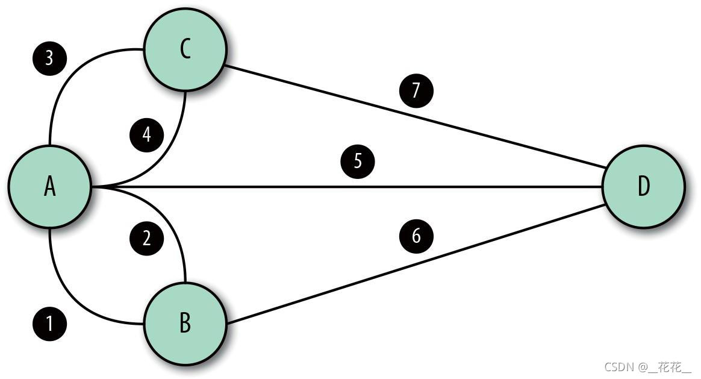

​	离散数学中有一章图论，专门研究图的问题。创始人叫欧拉。上面的问题成为欧拉回路。

​		欧拉回路的判定规则：
​			1.如果通奇数桥的地方多于两个，则不存在欧拉回路；
​			2.如果只有两个地方通奇数桥，可以从这两个地方之一出发，找到欧拉回路；
​			3.如果没有一个地方是通奇数桥的，则无论从哪里出发，都能找到欧拉回路。

​		延伸的还有汉密尔顿回路。有兴趣可以去自行研究。	

​		**总结：** 图是由顶点集合(Vertex)及顶点间的关系集合组成的一种数据结构：Graph＝( V, E )

### 	2.2 图有啥用

​		联通关系的表示，是从古至今考虑路径问题的基本方式。

​		显示生活中很多，比如地图，交通运输网，地铁网络，朋友关系等等。应用程序与游戏中都难免遇到这种业务逻辑的抽象。

### 	2.3 图的一些基本概念和表示方法

​		**顶点（vertex）**：图中的每个节点就是顶点。

​		**边（edge**）：图中两个顶点之间的线就叫做边。

​		**路径**：路径就是从某个顶点到另一个顶点所要经过的顶点序列。

​		**路径长度**：一条路径上经过的边的数量。

​		**回路**：一条路径的起点和终点为同一个顶点。

​		**度（Degree）**：在无向图中，点的度指与该点相连的边的数量。在有向图中，分为**出度**和**入度**，指向该点的边数称为入度；反之，则称为出度。有向图某点度的大小等于该点出度和入度之和。

​		**无向图**：所有的边都没有方向 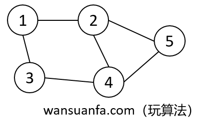

```tex
V（G）= {V1，V2，V3，V4，V5}
E（G）= {(V1,V2)，(V1，V3)，(V2，V4)，(V2，V5)，(V3，V4)，(V4，V5)}
```

​		**有向图**：所有的边都有方向 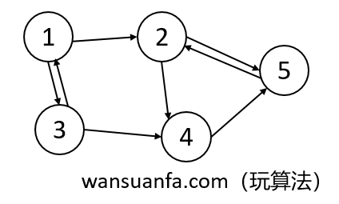

​	

```tex
V（G）= {V1，V2，V3，V4，V5}
E（G）= {<V1，V2>，<V1，V3>，<V2，V4>，<V2，V5>，<V3，V1>，<V3，V4>，<V4，V5>，<V5，V2>}
```

​		**完全图**：在完全图中任意一对顶点之间都有边相连。又可以分为无向完全图与有向完全图。

​		**稀疏图**：边很少的图称为稀疏图。

​		**稠密图**：边相对比较多的图称为稠密图。

​		**加权图**：对图 `G` 的每一条边 `e` 来说，都对应于一个值 `v` ，我们把这个 `v` 称为 `e` 的权，把这样的图 `G` 称为加权图	

​				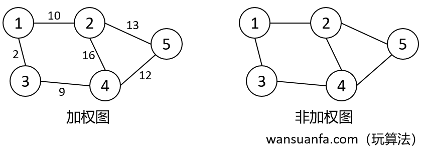  

​		还有一些概念，有兴趣的可以继续研究。

### 	2.4 图的存储方式

​		**邻接矩阵：**

​			说明 拥有n个顶点的图，它所包含的连接数量最多是n（n-1）个；因此，要表达各个顶点之间的关联关系，最清晰易懂的方式是使用二维数组（矩阵）。

​             									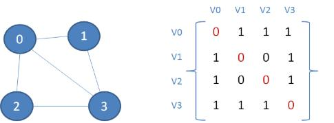

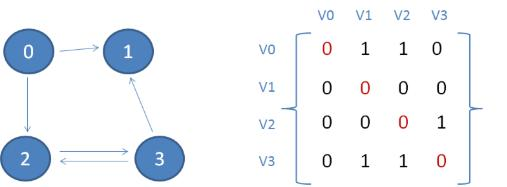

​		？？上面的两张图有什么区别没？

- 优点：简单直观，可以快速查到一个顶点和另一顶点之间的关联关系。
- 缺点：占用空间大，如果一个图有1000个顶点，其中只有10个顶点之间有关联（这种情况叫作稀疏图），却不得不建立一个1000X1000的二维数组。

​		**邻接表**

​			图的每一个顶点都是一个链表的头节点，其后连接着该顶点能够直接达到的相邻顶点。

​				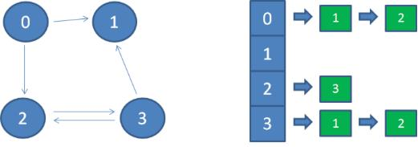

### 	2.5 图的搜索问题

​		**目的：**对图的遍历。

​		**深度优先遍历：** 也有称为深度优先搜索，简称DFS（Depth First Search）。其实，就像是一棵树的前序遍历。它从图中某个节点v出发，访问此顶点，然后从v的未被访问的邻接点出发深度优先遍历图，直至图中所有和v有 路径相通的顶点都被访问到。若图中尚有顶点未被访问，则另选图中一个未曾被访问的顶点作起始点，重复上述过程，直至图中的所有顶点都被访问到为止。

​	**广度优先遍历：** 也称广度优先搜索，简称BFS（Breadth First Search）。BFS算法是一个分层搜索的过程，和树的层序遍历算法类同，它也需要一个队列以保持遍历过的顶点顺序，以便按出队的顺序再去访问这些顶点的邻接顶点。

### 2.6 总结与思考

​		1）所有涉及多关系的度可以用图。

​		2）地图问题、多边外交问题、工程进度、等等。

​		3）建立思维框架，寻找最短路径，

​		**思考：**

​			1）尝试考虑根据邻接表来遵照最短路径的算法。


## 	3 散列表

### 	3.1 散列表是个啥玩意儿

​		Hash table，也叫哈希表

​		基本概念就是不相关的，没有顺序，没有连接关系；

​		对于一堆不相关的数据元素，要解决什么问题呢？

### 	3.2 关于查找的那些事儿

​		如何查找，发挥你的思路想一想。。。

​		人类走到今天，几乎99%的问题都是使用**Key**来实现查找的，所以这个**极其重要**的概念就这么诞生了！

​		**Key-Value**的概念，Map的应用几乎成了你手中的筷子。

```
Map map = new Map();
map.add("老张", data);
Data data = map.get("老张")；

```

​			ID是个啥玩意儿？大量的内存数据存储类型，玩家背包，玩家数据，

​			数据库都是Key-Value的。键值不仅是个Key，还是一个"Key"。

​			知识是个库，找到你的Key。百度是个库，你得有你的Key。

​			世界已经给你建好了他的库，你需要构建自己的库，也需要参与构建世界的库

### 	3.3 主要的查找算法

​		我们主要最求目的是提高查找效率！

​		一个基本概念：比较次数，或者说**平均查找长度（ASL）**来衡量查找的效率。一般以查找失败所用的比较次数来衡量。

​		目前的查找方法：

##### 			3.3.1、顺序查找

​				一个也不漏掉，直到找到为止；故ASL = O(n)；扫描整表，n很大，就无法接受了。

##### 			3.3.2、折半查找

​						每次将搜索空间减少一半(折半)，直到查找成功或失败为止。

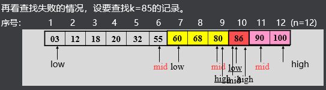

​				查找复杂度是多少？

​					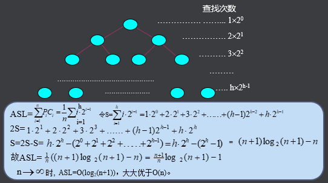

##### 		3.3.3、分块查找

​			设记录表长为n，将表的n个记录分成b=[n/s]个块，每块s个记录（最后一块记录数可以少于s个），且表分块有序，即第i（1≤i≤b-1）块所有记录的key小于第i+1块中记录的key，但块内记录可以无序

​			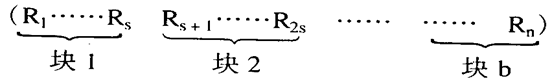

且表分块有序，即第i（1≤i≤b-1）块所有记录的key小于第i+1块中记录的key，但块内记录可以无序

可以组合折半查找。

##### 	3.3.4 以上三种总结

​		1）ASL的量级在O(n)～O(log2n)之间；

​		2）不论ASL在哪个量级，都与记录长度n有关。随着n的扩大，算法的效率会越来越低。

​		3）ASL与n有关是因为记录在存储器中的存放是随机的，或者说记录的key与记录的存放地址无关，因而查找只能建立在key的“比较”基础上。

### 3.4 Hash查找

#### 	3.4.1 Hash要干啥？

​	建立在地址的基础上，			

​	要求在建立记录表的时候，确定记录的key与其存储地址之间的关系f，即使key与记录的存放地址H相对应；

​	当要查找key=k的记录时，通过关系f就可得到相应记录的地址而获取记录，从而免去了key的比较过程。

​	这个关系f就是所谓的Hash函数（或称散列函数、杂凑函数），记为Hash(key)。

​	它实际上是一个地址映象函数，其自变量为记录的key，函数值为记录的存储地址（或称Hash地址）。

#### 	3.4.2 Hash的要求

​	找到那个Key就是需要一个函数，我们称之散列函数，或者叫哈希函数。

​	散列函数的要求：

​			1、散列函数计算得到的散列值必须是大于等于0的正整数，因为hash值需要作为数组的下标。

​			2、如果key1==key2，那么经过hash后得到的哈希值也必相同，hash（key1）==hash（key2）

​			3、如果key1！=key2，那么经过hash后得到的哈希值也比不相同即：hash（key1）！=hash（key2）

​	根据选取的Hash函数H(key)和处理冲突的方法，将一组记录(R1 R2……Rn)映象到记录的存储空间，所得到的记录表称为Hash表，如图：

​	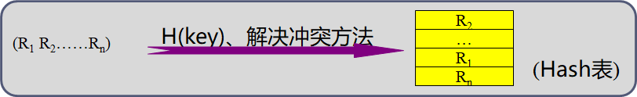

也叫**映射表 （Map）**，这就是你今后要用的筷子！

#### 	3.4.3 Hash的构建方法

​		选取（或构造）Hash函数的方法很多，原则是尽可能将记录均匀分布，以减少冲突现象的发生。以下介绍几种常用的构造方法。

​		**直接地址法：**取关键字或关键字的某个线性函数值为散列地址。

​		**数字分析法**：通过对数据的分析，发现数据中冲突较少的部分，并构造散列地址。

​		**平方取中法：**当无法确定关键字里哪几位的分布相对比较均匀时，可以先求出关键字的平方值，然后按需要取平方值的中间几位作为散列地址。

​		**取随机数法**：使用一个随机函数，取关键字的随机值作为散列地址，这种方式通常用于关键字长度不同的场合。

​		**保留除数法：**又称质数除余法，设Hash表空间长度为m，选取一个不大于m的最大质数p，  H(key)=key%p

​	这里只是大概介绍，怎么构建Hash其实是一个数学问题。还可能会涉及到MD5等一些字符串和数字解析算法。

​	目前来讲，几乎没有一个程序员需要掌握这个算法，因为几乎不论那个语言都有Hash函数可供使用，甚至一般都提供了映射表或者叫字典表这种库来使用，它将会是及其常用的库，我们只需要掌握怎么使用就好。

​	STL里面叫做Map。

#### 	3.4.3 Hash的问题

​		•不同的key可能得到同一个Hash地址，即当keyl≠key2时，可能有H(key1)=H(key2)，此时称key1和key2为**同义词**。这种现象称为“**冲突**”或“碰撞”，因为一个数据单位只可存放一条记录。

​		•一般，选取Hash函数只能做到使冲突尽可能少，却不能完全避免。这就要求在出现冲突之后，寻求适当的方法来解决冲突记录的存放问题。

#### 	3.4.4 处理冲突的一般处理方法

​		•处理冲突的方法一般为：在地址j的前面或后面找一个空闲单元存放冲突的记录，或将相冲突的诸记录拉成链表。

​		•在处理冲突的过程中，可能发生一连串的冲突现象，即可能得到一个地址序列H1、H2……Hn，Hi∈[0，m-l]。H1是冲突时选取的下一地址，而H1中可能己有记录，又设法得到下一地址H2……直到某个Hn不发生冲突为止。这种现象称为“**聚积**”，它严重影响了Hash表的查找效率。

​	**你放心，你用到的映射表一定是已经处理了冲突问题的。**

### 3.5 总结

​	Hash表在数据结构里面是个另类，几乎没有关系可言；

​	但是Key-Value的概念和Map的使用，简直就是程序员的必知必会。

​	贴几个Map常用的接口，也许你后面用到的名字不一定是这个，以后面介绍库的老师介绍为准。这里只是一个感性的认识。

```c
Map map = new Map<String, Data>;
map.add("老张", NewData(123,"张三"));
map.add("老李", NewData(234,"李四"));
map.add("老王", NewData(456,"王五"));
Data data = map.Get("老李");
Data data = map.Remove("老张");
```


# 三 数据结构的简单总结

## 1 几个基本数据结构的比较

​			比较什么：**查找、遍历、动态扩容**

​			在这个比较里面，栈、队列属于链表范畴

| <font color=#0000ff >关键需求</font> | 数组（Array）                        | 链表（List）                         | 映射表（Map）                        |
| ------------------------------------ | ------------------------------------ | ------------------------------------ | ------------------------------------ |
| <font color=#00ffff >查找</font>     | 容易                                 | **<font color=#ff0000 >困难</font>** | 容易                                 |
| <font color=#00ffff >遍历</font>     | 容易                                 | 容易                                 | **<font color=#ff0000 >困难</font>** |
| <font color=#00ffff >动态扩容</font> | **<font color=#ff0000 >困难</font>** | 容易                                 | 容易                                 |

​		树的性能居中，但是一般用于更底层，在实际业务逻辑里面用得较少，但是其思想是很多算法的基础。

​		**性能的两个指标**，CPU消耗与内存；历史是有一定变迁的。包括执行效率与开发效率。

## 2 划几个重点，一起回头复习一下

​			**顺序表：**其实挺常用的，很多业务其实是固定长度的，最好优先使用；

​			**链表：**如果不讲究查找，且一定要动态扩容，就考虑链表；

​			**栈：**递归里面常用来缓存数据，但凡用到递归，优先考虑出入栈；

​			**队列：**高并发常用，数据和人都需要排队；

​			**映射表：**常用，几乎没有哪个项目不用到；快速查找是一双直接的筷子。关键问题是要有明确的Key。

​			**树、图的概念：**要建立起来，暂时可能用不上，但是今后一定会有算法用到；先把他放到口袋里，今后会成为你的致胜法宝，也是你能迈向更高阶算法的基础。

## 3 学习方法

​			1）多用，今后学了库，要多使用库，多看别人的代码；

​			2）学会比较分析，建立独立判断能力，用数据来作为依据；

​			3）对于不常用的，要建立概念，记住名字，名字就是那个Key，记住那个Key，今后你就找得到这个知识点，就能够捡起来用得上。

​			4）勤于思考，积累算法；

