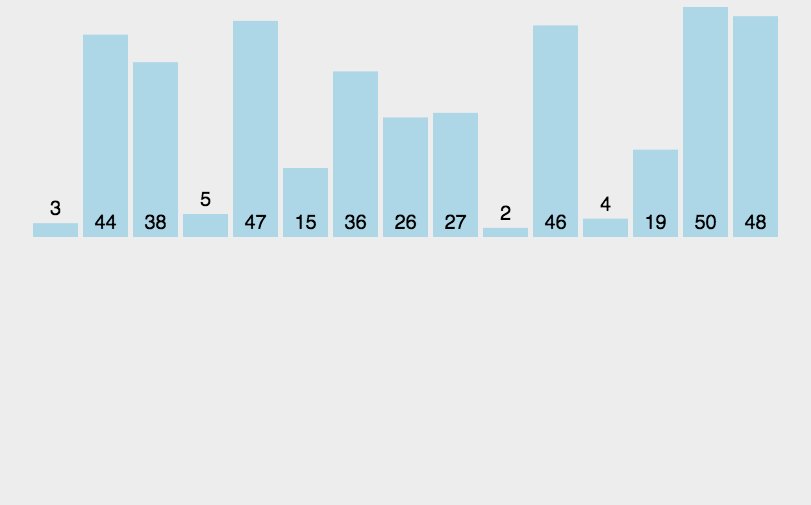
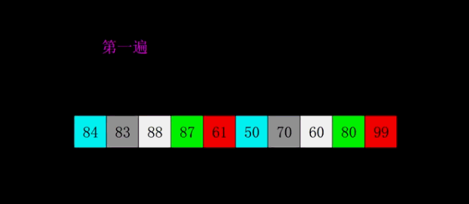
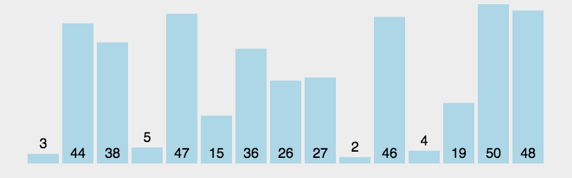
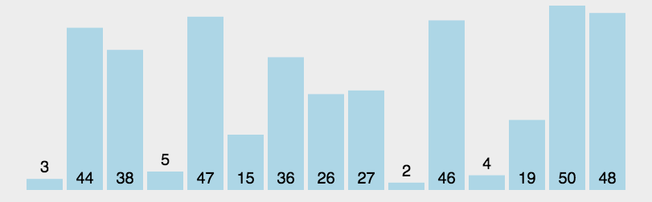

## 课程介绍

- ​	算法的一些概念
- ​    几个常用的算法简单介绍
- ​    常用排序算法介绍

# 一 算法介绍

## 	1 什么是算法

​		**算法(algorithm，[ˈælɡərɪðəm]，计算程序)：** 是指解题方案的准确而完整的描述，是一系列解决问题的清晰指令，算法代表着用系统的方法描述解决问题的策略机制。也就是说，能够对一定规范的输入，在有限时间内获得所要求的输出。

​		一句话概括一下，算法就是解决问题的操作步骤。

​		世界是算法来控制的；

​		但是有个前提：算力和存储都是有限的；

## 	2 算法的特性

​		**输入项**，一个算法有0个或多个输入，以刻画运算对象初始情况；

​		**输出项**，一个算法有一个或多个输出以反映对输入数据加工后的结果；

​		**可行性**，算法中执行的任何计算步骤都可被分解为基本的可执行的操作步骤；

​		**有穷性**，算法必须能在执行有限个步骤之后终止；

​		**确切性**，算法的每一步骤必须有确切的定义；（存疑了）

## 	3 算法的判断标准

​		**正确性**：执行结果不能有错误，是评价的最基本标准；

​		**时间复杂度**：程序运行时基本操作所执行的次数；算力

​			一般情况下，算法中基本操作重复执行的次数是问题规模n的某个函数，用T(n)表示，若有某个辅助函数f(n)，使得当n趋近于无穷大时，T(n)/f(n)的**极限值为不等于零的常数**，则称f(n)是T(n)的**同数量级**函数。记作T(n)=O(f(n))，称O(f(n)) 为算法的**渐进时间复杂度**，简称时间复杂度。其中f(n)就是下图O中的函数：

​			

​		**空间复杂度**：对一个算法在运行中临时占用存储空间大小；存储

​		**可读性**：人为阅读和理解的难易程度；与书写习惯和使用习惯有关，有时候与时间复杂度相冲，也需要平衡；

​		**健壮性（鲁棒性、容错性）**：对不合理输入的反应和处理能力，有更好的环境适应性；一个重要的指标，时间复杂度往往为此做一定让渡。

​		上面几个指标的平衡与优先级。。。。

​		一般意义上：正确性>健壮性>时间复杂度>可读性>空间复杂度（但是基于达到一定程度）

​		**具体程度与标准：**

​			正确性：不言而喻；

​			健壮性：别出现异常，别出现死循环，不要越界，一些常见问题，能容错；

​			时间复杂度：越快越好；

​			可读性：遵循公司标准和常用习惯，多看代码，有一些共识；

​			空间复杂度：现在的程序，只要不是太浪费空间，一般都能容忍；

​			除了习惯以外，更多时候就是算力和存储的平衡。

## 	4 AI的感性认识

​		算法在新时代的爆发。

​		AI经历了专家系统到机器学习，现在的大模型是过去所有算法与大数据的集大成，也是未来算法发展的基石。

## 5 几个常用算法介绍

### 	5.1、递归算法：

​		是一种直接或者间接地调用自身的算法。在计算机编写程序中，递归算法对解决一大类问题是十分有效的，它往往使算法的描述简洁而且易于理解。把问题转化为规模缩小了的同类问题的子问题。

### 	5.2、排序算法

​		排序是程序设计中常做的操作，初学者往往只知道冒泡排序算法，其实还有很多效率更高的排序算法，不同的排序算法，适用于不同的场景，本章最后从时间性能，算法稳定性等方面，分析各种排序算法。

### 	5.3、查找算法

​		一般指二分査找

​		首先选取表中间位置的记录，将其关键字与给定关键字 key 进行比较，若相等，则査找成功；若 key 值比该关键字值大，则要找的元素一定在右子表中，则继续对右子表进行折半查找；若 key 值比该关键宇值小，则要找的元素一定在左子表中，继续对左子表进行折半査找。如此递推，直到査找成功或査找失败（或査找范围为 0）。

### 	5.4、搜索算法

​		搜索算法是利用计算机的高性能来有目的的穷举一个问题解空间的部分或所有的可能情况，从而求出问题的解的一种方法。

​		现阶段一般有枚举算法、深度优先搜索、广度优先搜索、A*算法、回溯算法、散列函数等算法。

### 	5.5、哈希算法

​		是一个典型的利用空间换取时间的算法，把任意长度的输入（又叫做预映射pre-image）通过散列算法变换成固定长度的输出，该输出就是散列值。

### 	5.6、贪心算法

​		贪心算法（又称贪婪算法）是指，在对问题求解时，总是做出在当前看来是最好的选择。也就是说，不从整体最优上加以考虑，他所做出的仅是在某种意义上的局部最优解。决策树，决策森林。

### 	5.7、分治算法

​		分治算法的基本思想是将一个规模为N的问题分解为K个规模较小的子问题，这些子问题相互独立且与原问题性质相同。

### 	5.8、动态规划(DP)算法

​		动态规划过程：每一次决策依赖于当前的状态，即下一状态的产生取决于当前状态。一个决策序列就是在变化的状态中产生的，这种多阶段最优化问题的求解过程就是动态规则过程。在分治的基础上增加了前后的关联性。

### 	5.10、字符串匹配算法

​		字符串匹配问题就是在一个大的字符串T中搜索某个字符串P的所有出现位置。

​		算法分支很多，一般都需要建立索引和筛选剪枝，减少匹配次数。

​		合法校验，脏字库匹配，非常常用！

### 5.11 位运算

​		用二进制数的运算思维来解决问题。主要用于标定一堆bool类型数据。

​		运算方式包括与、或、移位；

​		游戏开发中非常常用；

### 5.12 状态机

​		状态机（State Machine）是一种数学模型，用于描述系统或程序在不同状态之间转换的行为。它由一组状态、转移条件和动作组成。严格意义不是一个算法，但是一种非常常见的程序结构。

# 二 几种常用排序算法

## **1 基本概念**

排序是处理数据的一种最常见的操作，所谓排序就是将数据按某字段规律排列，所谓的字段就是数据节点的其中一个属性。比如一个班级的学生，其字段就有学号、姓名、班级、分数等等，我们既可以针对学号排序，也可以针对分数排序。

- 稳定性  
  在一组无序数据中，若两个待排序字段一致的数据，在排序前后相对位置不变，则称排序算法是稳定的，否则是不稳定的。（应该是原先有序的在排序中会不会出现改变）
- 内排序与外排序  
  如果待排序数据量不大，可以一次性全部装进内存进行处理，则称为内排序，若数据量大到无法一次性全部装进内存，而需要将数据暂存外存，分批次读入内存进行处理，则称为外排序。  

## 	2 选择排序 

​		

​	遍历两层，复杂度较高

## 	3 插入排序

​		

​		减少队列和构建新的队列，新的队列插入算法可以优化。

## 	4 希尔排序 

​		

​		插入排序的升级版，一开始分成几组，每组内部排序，逐步减少分组数量。

## 	5 冒泡排序 

​		

​		姚老师已经讲过了，这里就不做介绍了，复杂度比选择排序好一些

## 	6 快速排序

​		

​	几个做法：

​		两端往中间走：在l>k>r时交换；

​		挖坑移树法：也是两端往中间走，将Key位腾出来，存放L和R碰到的大和小的数据，

​		前后指针（交换小的在前）：如图，重点讲，是前面两种做法的进化版，目前也是用的比较多的。


​		思路：

​			大原则（跟前面一样）：用一个Key来分割所有数据成为“<K<”，然后继续前后分别递归继续；

​			分割时：用一个cur游标，从头找到尾，找出小的数据放到“后面队列”，用一个Prev（后面队列的车头）来推动大的数据将cur发现的小数交换到后面。

​		实操代码课上写：

```c
// 前后游标快速排序函数,作为计算单元进行递归计算
void FastSortPC(int vals[], int start, int end)
{
    // 校验Start与end的合法性
    // 创建游标与key
    // 循环cur游标并判断是否到了end
    	// 如果cur找到小数,用prev往前推大数(prev看着是小数的队头),交换小数与前面的大数
    // 到尾了,交换key(start位)与小数队头(prev)
    // 将key数两边队列分别进行递归排序 
}
```


- 

## 7 性能分析

不同的排序算法性能不同，详细性能数据如下表所示。

稳定性：

| 排序算法 | 平均 $T(n)$   | 最坏 $T(n)$ | 最好 $T(n)$   | 空间复杂度    | 稳定性 |
| -------- | ------------- | ----------- | ------------- | ------------- | ------ |
| 选择排序 | $O(n^2)$      | $O(n^2)$    | $O(n^2)$      | $O(1)$        | 不稳定 |
| 插入排序 | $O(n^2)$      | $O(n^2)$    | $O(n)$        | $O(1)$        | 稳定   |
| 希尔排序 | $O(n^{1.3})$  | $O(n^2)$    | $O(n)$        | $O(1)$        | 不稳定 |
| 冒泡排序 | $O(n^2)$      | $O(n^2)$    | $O(n)$        | $O(1)$        | 稳定   |
| 快速排序 | $O(n\log_2n)$ | $O(n^2)$    | $O(n\log_2n)$ | $O(n\log_2n)$ | 不稳定 |

从表中可以得到一些简单的指导思路：  

1. 选择排序、插入排序和冒泡排序思路简单，但时间效率较差，只适用于数据样本较小的场合，这几种算法的好处是不需要额外开辟空间，空间复杂度是常量。
2. 希尔排序是插入排序的改进版，在平均情况下时间效率要比直接插入法好很多，也不需要额外开辟空间，要注意的是希尔排序是不稳定排序。
3. 快速排序是所有排序算法中时间效率最高的，但由于快排是一种递归运算，对内存空间要求较高，当数据量较大时，会消耗较多的内存。


# 三 关于 项目

​	1 学生管理系统

​		代码可以自己构建

​	2 俄罗斯方块的OpenGL版，

​		文件系统的使用

​		研究OpenGL

​		简单游戏框架的OpenGL封装版

​	3 MUD框架与任务系统、交互小说


周六的作业

昨天的作业

代码BUG调试

